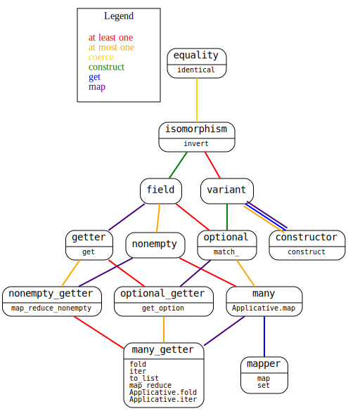

Introduction
============

The `Accessor` library makes it nicer to work with functional data
structures.

To get started with `Accessor`, select which accessor library you
would like to use (e.g. `accessor_base`, `accessor_core`,
`accessor_async`), based on what dependencies you are willing to link
against, and bind it as `Accessor` in your project. It is also
recommended that you open `Accessor.O` to reduce boilerplate. Finally,
make sure to add the library you selected to your jbuild, and if you
will be defining your own accessors, you probably also want to add
`ppx_accessor` to your syntax extensions.

Here is what we will be using for this tutorial:

```ocaml
open! Core
open! Async
module Accessor = Accessor_async
open Accessor.O
let print_s = Core.print_s
```

Motivation
==========

The simplest problem solved by `Accessor` is updating nested records.
Let's take the following types as an example:

```ocaml
type coordinate =
  { row : int
  ; col : int
  }
[@@deriving accessors, sexp_of]

type cell =
  { contents : string
  ; location : coordinate
  }
[@@deriving accessors, sexp_of]
```

You probably noticed `[@@deriving accessors]`, but let's not dwell on
that, for now.

To shift the location of a cell to the right by one in native OCaml,
we might normally write something like this:

```ocaml
# let shift_cell_right cell =
    let location = cell.location in
    let col = location.col in
    { cell with location = { location with col = succ col } }
val shift_cell_right : cell -> cell = <fun>
```

This style becomes more unwieldly as the level of nesting increases.
`Accessor` solves this problem by allowing you to write this instead:

```ocaml
# let shift_cell_right cell = Accessor.map (location @> col) cell ~f:succ
val shift_cell_right : cell -> cell = <fun>
```

Here's a small demonstration that it works:

```ocaml
# let cell = { contents = "A"; location = { row = 1; col = 2 } } in
  shift_cell_right cell
- : cell = {contents = "A"; location = {row = 1; col = 3}}
```

Let's create another type:

```ocaml
type shape = { cells : cell list } [@@deriving accessors]
```

It is possible to shift an entire `shape` at once, like this:

```ocaml
# let shift_shape_right shape =
    Accessor.map (cells @> Accessor.List.each @> location @> col) shape ~f:succ
val shift_shape_right : shape -> shape = <fun>
```

Here's a small demonstration that this also works:

```ocaml
# let shape =
    let cell_a = { contents = "A"; location = { row = 1; col = 2 } } in
    let cell_b = { contents = "B"; location = { row = 3; col = 4 } } in
    { cells = [ cell_a; cell_b ] }
  in
  shift_shape_right shape
- : shape =
{cells =
  [{contents = "A"; location = {row = 1; col = 3}};
   {contents = "B"; location = {row = 3; col = 5}}]}
```

`field` accessors
=================

A `field` is a kind of accessor that knows how to `get` and `set` some
data within a larger data structure. In the previous section, `row`,
`col`, `contents`, `location`, and `cells` were all examples of field
accessors, generated for us automatically by `[@@deriving accessors]`.
We have already seen them used to modify values using `Accessor.map`,
but field accessors can also be used to extract values, using
`Accessor.get`:

```ocaml
# let cell = { contents = "A"; location = { row = 1; col = 2 } } in
  Accessor.get (location @> col) cell
- : int = 2
```

One can imagine that field accessors could be represented with a
record with functions for "getting" and "setting":

```ocaml
type ('inner, 'outer) getter_setter =
  { get : 'outer -> 'inner
  ; set : 'outer -> 'inner -> 'outer
  }
```

This isn't how field accessors are actually represented, but it's
representative enough for teaching purposes.

The type of a `field`
---------------------

`Accessor.t` only has three arguments, but the arguments are
structured. Here are simplified types for a couple fields we have
already seen:

```ocaml
let location : (_, coordinate, cell,       [< field ]) Accessor.Simple.t = location
let col      : (_, int,        coordinate, [< field ]) Accessor.Simple.t = col
```

The `location` accessor is a field containing the information needed
to get or set the `location` record field of the `cell` type, which is
a `coordinate`. The `col` accessor is a field containing the
information needed to get or set the `col` record field of the
`coordinate` type, which is an `int`.

`Accessor.Simple.t` is a type alias reducing some of the boilerplate
that often appears when using `Accessor.t`. The first argument of
`Accessor.Simple.t` is usually left as an underscore. The second
argument is the type of inner values we are accessing. The third
argument is the type of the composite data structure we are reaching
into. The last argument is an indication of what "kind" of accessor it
is, a `field` in these cases.

Here are less simple versions of these accessors' types:

```ocaml
let location
  : ( 'i -> coordinate -> coordinate
    , 'i -> cell       -> cell
    , [< field ]
    ) Accessor.t
  = location

let col
  : ( 'i -> int        -> int
    , 'i -> coordinate -> coordinate
    , [< field ]
    ) Accessor.t
  = col
```

The first two type parameters of an `Accessor.t` are always rendered
as function types taking two arguments. The first function type
represents an "inner mapping", and the second function type represents
an "outer mapping". Disregarding the first arguments of the functions
(the `'i` in the above examples), one might read the above type of
`location` as a `field` that transforms a mapping from `coordinate` to
`coordinate` into a mapping from `cell` to `cell`.

We're using the word "mapping" to try to convey that it is more
general than a function. The concrete instantiation of the mappings is
determined by how you are using the accessor.

`Accessor.map` treats the mappings as literal functions. It's a bit
easier to see this by rearranging its type a bit:

```ocaml
let map
  :  (_ -> 'inner -> 'inner,    _ -> 'outer -> 'outer, [> field ]) Accessor.t
  ->      ('inner -> 'inner) ->     ('outer -> 'outer)
  = fun accessor f outer -> Accessor.map accessor outer ~f
```

`Accessor.set` is just defined in terms of `Accessor.map`:

```ocaml
let set accessor outer ~to_:inner = Accessor.map accessor outer ~f:(fun _ -> inner)
```

What about `Accessor.get`? It's a bit harder to see, but it works by
disregarding the apparent return types of the functions and forcing
them to just be the inner type. It's as though this is the mapping
type:

```ocaml
type ('input, 'output, 'result) get_mapping = 'input -> 'result
```

Some generous reshuffling of the type of `Accessor.get` hopefully
shows this clearly enough:

```ocaml
let get
  :  ( _ ->        'inner -> 'inner
     , _ ->        'outer -> 'outer
     , [> field ]
     ) Accessor.t
  ->              ('inner,   'inner, 'result) get_mapping
  ->              ('outer,   'outer, 'result) get_mapping
  = fun accessor f outer -> f (Accessor.get accessor outer)
```

You can recover the type of `Accessor.get` from the above definition
by forcing the function argument to be `Fn.id`:

```ocaml
let get
  :  (_ -> 'inner -> 'inner, _ -> 'outer -> 'outer, [> field ]) Accessor.t
  -> 'outer
  -> 'inner
  = fun accessor outer -> get accessor Fn.id outer
```

Creating `field` accessors
--------------------------

There are two ways to define new field accessors. We have already seen
one, which is to use `[@@deriving accessors]` on a record type
definition. The other way is to define it manually using
`Accessor.field`. For example, here is how to define the `location`
field by hand:

```ocaml
let location =
  Accessor.field
    ~get:(fun cell -> cell.location)
    ~set:(fun cell location -> { cell with location })
```

And here is some evidence that it's working:

```ocaml
# let cell = { contents = "A"; location = { row = 1; col = 2 } } in
  Accessor.get location cell
- : coordinate = {row = 1; col = 2}
```

Unfortunately, this isn't normally good enough in practice. The
compiler is not able to infer a sufficiently general type given just
the above definition. To see the problem, you have to try using the
accessor two different ways.

```ocaml
# let cell_a = { contents = "A"; location = { row = 1; col = 2 } }
  and cell_b = { contents = "B"; location = { row = 3; col = 4 } }
  in

  let shape = { cells = [ cell_a; cell_b ] } in

  Accessor.map (cells @> Accessor.List.each @> location @> row) shape ~f:succ
Line 7, characters 48-63:
Error: This expression has type
         (unit -> int -> int, unit -> cell -> cell,
          [< Accessor.field > `at_least_one `at_most_one `get ] as 'a)
         Accessor.t
       but an expression was expected of type
         (unit -> int -> int, unit -> cell -> cell,
          [< Accessor_base__Import.many ] as 'b)
         Accessor.t
       Type
         'a =
           [< `at_least_one | `at_most_one | `get | `map
            > `at_least_one `at_most_one `get ]
       is not compatible with type 'b = [< `get | `map ]
       The second variant type does not allow tag(s)
       `at_least_one, `at_most_one
```

That ugly type error is telling us that the compiler is having trouble
figuring out that it's okay for `Accessor.List.each` and `location` to
be composed with each other. `Accessor.List.each` is not a `field`
accessor but a `many` accessor, and all the accessors being composed
have to be of the same kind. Ordinarily, this would work out fine,
because `field` is a *subtype* of `many`, but the value restriction is
preventing the compiler from generalizing the `field` accessor into a
`many` accessor, because we already specialized it to a particular
kind when we used `Accessor.get` earlier.

In addition to `[@@deriving accessors]`, `ppx_accessor` also provides
an `[%accessor]` syntax to help generalize your hand-written
accessors. Here is how to use it:

```ocaml
let location =
  [%accessor
    Accessor.field
      ~get:(fun cell -> cell.location)
      ~set:(fun cell location -> { cell with location })]
```

Now we can do all the things we wanted to do before:

```ocaml
# let cell = { contents = "A"; location = { row = 1; col = 2 } } in
  Accessor.get location cell
- : coordinate = {row = 1; col = 2}

# let cell_a = { contents = "A"; location = { row = 1; col = 2 } }
  and cell_b = { contents = "B"; location = { row = 3; col = 4 } }
  in

  let shape = { cells = [ cell_a; cell_b ] } in

  Accessor.map (cells @> Accessor.List.each @> location @> row) shape ~f:succ
- : shape =
{cells =
  [{contents = "A"; location = {row = 2; col = 2}};
   {contents = "B"; location = {row = 4; col = 4}}]}
```

Under the hood, accessors are functions. All `[%accessor]` is doing is
eta expanding the definition to avoid the value restriction.

Combining accessors
===================

We've already seen how to compose accessors. You do it using `( @> )`.
An accessor is a function that transforms one mapping into another, so
`( @> )` is function composition. You can think of the type as
something like this:

```
val ( @> )
  :  ('b mapping -> 'c mapping)
  -> ('a mapping -> 'b mapping)
  -> ('a mapping -> 'c mapping)
```

The actual type doesn't even look very different:

```ocaml
# #show ( @> )
val ( @> ) :
  ('middle, 'outer, 'kind) Accessor.t ->
  ('inner, 'middle, 'kind) Accessor.t -> ('inner, 'outer, 'kind) Accessor.t
```

Previously, we had defined a new field by composing the `location` and
`col` fields. The resulting field gives us access to the `col` field
of a `cell`:

```ocaml
# #show location
val location :
  ('a -> coordinate -> coordinate, 'a -> cell -> cell, [< Accessor.field ])
  Accessor.t

# #show col
val col :
  ('i -> int -> int, 'i -> coordinate -> coordinate, [< Accessor.field ])
  Accessor.t

# let location_col = [%accessor location @> col]
val location_col :
  ('a -> int -> int, 'a -> cell -> cell, [< Accessor.field ]) Accessor.t =
  {Accessor.f = <fun>}
```

The resulting accessor is just as useful as the originals and can be
used for getting and setting:

```ocaml
# Accessor.get location_col
- : cell -> int = <fun>

# Accessor.set location_col
- : cell -> to_:int -> cell = <fun>

# Accessor.map location_col
- : cell -> f:(int -> int) -> cell = <fun>
```

Indexing operators
==================

`Accessor` defines a family of convenient indexing operators. You can
use `( .@() )` instead of `Accessor.get`:

```ocaml
# let cell = { contents = "A"; location = { row = 1; col = 2 } } in
  cell.@(location @> col)
- : int = 2
```

You can use `( .@()<- )` instead of `Accessor.set`:

```ocaml
# let cell = { contents = "A"; location = { row = 1; col = 2 } } in
  cell.@(location @> col) <- 0
- : cell = {contents = "A"; location = {row = 1; col = 0}}
```

Reusing accessors
=================

The fact that fields are values means you are not limited to using
them as a mere language feature. You can store them in data
structures, accept them as inputs to functions, and anything else you
can do with an OCaml value.

Let's take our shifting functions from earlier as an example:

```ocaml
let shift_cell_right cell = Accessor.map (location @> col) cell ~f:succ

let shift_shape_right shape =
  Accessor.map (cells @> Accessor.List.each @> location @> col) shape ~f:succ
```

We don't really need to define separate functions for these. We could
just define one function for shifting the target of any accessor:

```ocaml
let shift_right accessor outer = Accessor.map accessor outer ~f:succ
```

And we could separately define accessors for the colums of cells or
shapes:

```ocaml
let cell_col = [%accessor location @> col]
let shape_col = [%accessor cells @> Accessor.List.each @> cell_col]
```

Observe that we even reused `cell_col` in the definition of
`shape_col`!

Now we can write code which reads quite similarly to our original
functions by simply using `shift_right` with these new accessors:

```ocaml
# shift_right cell_col
- : cell -> cell = <fun>

# shift_right shape_col
- : shape -> shape = <fun>
```

And we also get a bunch of other useful functionality, of which this
is only a taste:

```ocaml
# Accessor.set cell_col
- : cell -> to_:int -> cell = <fun>

# Accessor.set shape_col
- : shape -> to_:int -> shape = <fun>

# Accessor.get cell_col
- : cell -> int = <fun>

# Accessor.to_list shape_col
- : shape -> int list = <fun>
```

`many` accessors
================

A `many` accessor is like a `field`, but it accesses an arbitrary
number of values.

Many of the things you can do with a `field` you can also do with a
`many` accessor. `Accessor.map` works out of the box. `Accessor.set`
also works, because it is defined using `Accessor.map`. `Accessor.get`
does not work, but `Accessor.to_list` is a close equivalent.

The type of a `many` accessor
-----------------------------

We've already seen a `many` accessor in examples earlier:
`Accessor.List.each`. Here is (a specialization of) its type:

```ocaml
let each : (_, 'inner, 'outer list, [< many ]) Accessor.Simple.t = Accessor.List.each
```

Every `field` accessor is also a valid `many` accessor, which is what
has allowed us to compose a `field` accessor like `location` and a
`many` accessor like `Accessor.List.each` in previous examples. There
is no conversion required; it just works, via subtyping. Here is a
demonstration that `location` and `col` can be typechecked as `many`
accessors without converting explicitly:

```ocaml
let location : (_, coordinate, cell, [< many  ]) Accessor.Simple.t =
   (location : (_, coordinate, cell, [< field ]) Accessor.Simple.t)

let col : (_, int, coordinate, [< many  ]) Accessor.Simple.t =
   (col : (_, int, coordinate, [< field ]) Accessor.Simple.t)
```

Creating `many` accessors
-------------------------

The most common way of defining a `many` accessor is by just using
some other kind of accessor as a `many` accessor.

In addition to `field` accessors, `[@@deriving accessors]` can
generate a few other kinds of accessors that can be used as `many`
accessors, but we won't be discussing them in this section.

You can also define a `many` accessor manually, using `Accessor.many`.
To do so requires using an applicative interface, `Accessor.Many`,
specially designed for this purpose. For example, to define an
accessor of the `row` and `col` fields of a `coordinate`, you could
write this:

```ocaml
let row_and_col : (_, int, coordinate, [< many ]) Accessor.Simple.t =
  [%accessor
    Accessor.many (fun { row; col } ->
      let open Accessor.Many.Let_syntax in
      let%map_open row = access row
      and          col = access col
      in
      { row; col })]
```

Let's try it out:

```ocaml
# let coordinate = { row = 1; col = 2 } in
  Accessor.map row_and_col coordinate ~f:succ
- : coordinate = {row = 2; col = 3}
```

Polymorphism
============

Accessors support polymorphic update of data structures. For example,
`Accessor.map Accessor.List.each` can be used to change the type of
the elements of a list:

```ocaml
# Accessor.map Accessor.List.each [ "1"; "2" ] ~f:Int.of_string
- : int list = [1; 2]
```

To see how this works, first observe this rearranged type of
`Accessor.map Accessor.List.each`:

```ocaml
let list_map : ('a -> 'b) -> 'a list -> 'b list =
  fun f xs -> Accessor.map Accessor.List.each xs ~f
```

It's a function from a mapping `a -> b` to a mapping `a list -> b
list`. The mappings in the `Accessor.t` type are the same way:

```ocaml
let each : (_ -> 'a -> 'b, _ -> 'a list -> 'b list, [< many ]) Accessor.t =
  Accessor.List.each
```

Polymorphic update is the reason `Accessor.t` has so much apparent
redundancy in its type parameters. The types for accessors supporting
polymorphic update cannot be written using `Accessor.Simple.t`.

Indices
=======

When accessing values in a data structure, it is sometimes convenient
to be told how you got there. This is why `Base` has functions like
`List.mapi`, which supply the function argument the index, which is
what the `i` stands for, of the element being accessed in the list, or
`Map.mapi`, which supplies the function the key (which if you squint
is also an "index") of the element being accessed in the map.
Accessors can be defined to provide indices, too.

For example, `Accessor.List.eachi` supplies the index of each element
it accesses:

```ocaml
# let cell_a = { contents = "A"; location = { row = 1; col = 2 } }
  and cell_b = { contents = "B"; location = { row = 3; col = 4 } }
  in
  let shape = { cells = [ cell_a; cell_b ] } in
  Accessor.iteri (cells @> Accessor.List.eachi) shape ~f:(fun [ i ] cell ->
    print_s [%sexp (i, cell : int * cell)])
(0 ((contents A) (location ((row 1) (col 2)))))
(1 ((contents B) (location ((row 3) (col 4)))))
- : unit = ()
```

In order to use an "indexed" accessor like `Accessor.List.eachi`, you
have to use an indexed accessor consuming function like
`Accessor.iteri`. Most of the common accessor functions have indexed
counterparts.

Indexed accessors can be composed with unindexed accessors, which has
already been demonstrated. Indexed accessors can also be composed with
other indexed accessors, in which case their indices are combined
automatically. Multiple indices are provided to you in the form of a
stack, with the top of the stack being the innermost index. The
compiler knows the size of the stack statically, so you can just
pattern match on it directly, with only one case. The syntax for
pattern matching on indices is that same as for normal OCaml lists.
Here is an example of accessing the elements in a list of lists along
with their indices in both lists:

```ocaml
# Accessor.iteri
    (Accessor.List.eachi @> Accessor.List.eachi)
    [ [ "a"; "b" ]; [ "c"; "d"; "e" ] ]
    ~f:(fun [ inner; outer ] str ->
      print_s [%sexp (inner, outer, str : int * int * string)])
(0 0 a)
(1 0 b)
(0 1 c)
(1 1 d)
(2 1 e)
- : unit = ()
```

The type of indices
-------------------

Even though they are presented as lists, indices actually are given to
you using the following type:

```
module Index = struct
  type 'a t =
    | [] : unit t
    | ( :: ) : 'a * 'b t -> ('a * 'b) t
end
```

This type definition means the indices don't even have to have the
same types. For example, if you are accessing the data of a
`String.Map.t Int.Map.t`, your index could include both a `string` and
an `int`.

Accessors present indices in their types by filling in the positions
we've so far been rendering with underscores. Here are the actual,
complete types of `Accessor.List.each` and `Accessor.List.eachi`:

```ocaml
let each : ('i -> 'a -> 'b, 'i -> 'a list -> 'b list, [< many ]) Accessor.t =
  Accessor.List.each

let eachi : (int * 'i -> 'a -> 'b, 'i -> 'a list -> 'b list, [< many ]) Accessor.t =
  Accessor.List.eachi
```

Remember, accessors are mapping transformers. `Accessor.List.eachi`
transforms an inner mapping `int * i -> a -> b` into an outer mapping
`i -> a list -> b list`. That means it must be adding an `int` to the
top of the stack `i` before passing it to the inner mapping. Likewise,
`Accessor.List.each` just passes the stack through, unchanged.

When consuming an accessor, we always start with an empty stack, so
the outer mapping's first type argument will always be `unit`. An
unindexed consuming function will expect that the accessor doesn't
change the stack at all, so the inner mapping's first type argument
will also be `unit`:

```ocaml
let map
  :  (unit -> 'a -> 'b, unit -> 'at -> 'bt, [> many ]) Accessor.t -> 'at
  -> f:('a -> 'b) -> 'bt
  = Accessor.map
```

An indexed consuming function doesn't have such rigid expectations of
how the stack is updated:

```ocaml
let mapi
  :  ('i -> 'a -> 'b, unit -> 'at -> 'bt, [> many ]) Accessor.t -> 'at
  -> f:('i Accessor.Index.t -> 'a -> 'b) -> 'bt
  = Accessor.mapi
```

The indexed functions are strictly more expressive than the unindexed
ones, but the unindexed functions are a little more convenient when
you don't need to use indices, since the indexed functions would
require you to deal with a superfluous `[]` argument.

All kinds of accessors
======================

We've seen a couple kinds of accessors so far: `field` and `many`.
There are many more, and they are all related with subtyping:



A downward line from `A` to `B` means that an `A` can be freely
coerced into a `B`. For example, a `field` can be coerced into a
`getter`. The relationship is transitive. For example, because a
`getter` can be coerced into an `optional_getter`, a `field` can also
be coerced into an `optional_getter`.

When composing different kinds of accessors, the result is the nearest
common descendent in this diagram. Here are some examples:

- An `isomorphism` composed with a `field` is a `field`.
- A `field` composed with a `variant` is an `optional`.
- A `getter` composed with a `variant` is an `optional_getter`.

If you try to compose accessors with no common descendent, such as a
`constructor` with a `mapper`, compilation fails with a type error.

The diagram renders arrows in several colors, where each color
represents a feature that is lost as you coerce an accessor from one
kind to another. The features are, roughly:

- **red**: accesses at least one value
- **orange**: accesses at most one value
- **yellow**: inner and outer types are the same
- **green**: construct outer from inner
- **blue**: extract inner from outer
- **indigo**: update inner values within outer value

Generalized operations
----------------------

We've been sneakily using several of these accessor kinds throughout
the tutorial. Let's come clean, now.

`Accessor.get` works on any `getter`. As you can see from the diagram,
every `field` can be used as a `getter`. However, a `many` accessor
cannot be used as a `getter`, which is why `Accessor.get` does not
work with `Accessor.List.each`.

```ocaml
let get : (unit -> 'a -> _, unit -> 'at -> _, [> getter ]) Accessor.t -> 'at -> 'a =
  Accessor.get
```

`Accessor.to_list` works on any `many_getter`. As you can see from the diagram, every
`field` and every `many` can be used as a `many_getter`. This means you can use
`Accessor.to_list` on a `field` even though it targets exactly one value; you just get a
singleton list as a result.

```ocaml
let to_list
  : (unit -> 'a -> _, unit -> 'at -> _, [> many_getter ]) Accessor.t -> 'at -> 'a list
  = Accessor.to_list
```

`Accessor.map` works on any `mapper`. The diagram shows that `field` accessors and `many`
accessors both can be used as `mapper` accessors. However, the read-only accessors like
`getter` and `many_getter` cannot be used as `mapper` accessors.

```ocaml
let map
  :  (unit -> 'a -> 'b, unit -> 'at -> 'bt, [> mapper ]) Accessor.t -> 'at
  -> f:('a -> 'b) -> 'bt
  = Accessor.map
```

Brief summary of each kind of accessor
--------------------------------------

- `equality`: a proof that the outer and inner types are actually the same type
- `isomorphism`: can convert back and forth between the outer and inner types
- `field`: a getter and setter
- `variant`: an optional getter and constructor
- `optional`: like a field, but isn't sure that an inner value is present
- `getter`: can get an inner from an outer
- `constructor`: can create an outer from an inner
- `optional_getter`: like a getter, but isn't sure that an inner value is present
- `many`: like a field, but isn't sure how many inner values are present
- `many_getter`: like a getter, but isn't sure how many inner values are present
- `nonempty`: like a field, but has no upper bound on the count of inner values
- `nonempty_getter`: like a getter, but has no upper bound on the count of inner values
- `mapper`: can update/set the inner value(s) inside an outer value

Applicative and monadic operations
==================================

`Accessor` supports applicative and monadic code, too. For example,
here are a couple versions of functions we've already seen, but which
support using `Async`:

```ocaml
let map
  :  ?how:[ `Parallel | `Sequential ]
  -> (unit -> 'a -> 'b, unit -> 'at -> 'bt, [> many ]) Accessor.t
  -> 'at
  -> f:('a -> 'b Deferred.t)
  -> 'bt Deferred.t
  = Accessor.Deferred.map

let iter
  :  ?how:[ `Parallel | `Sequential ]
  -> (unit -> 'a -> _, unit -> 'at -> _, [> many_getter ]) Accessor.t
  -> 'at
  -> f:('a -> unit Deferred.t)
  -> unit Deferred.t
  = Accessor.Deferred.iter
```

There is a fairly large suite of monadic operations available, and
`Accessor` is a good solution to the combinatorial explosion of
operations that work on different data structures using different
monads.
